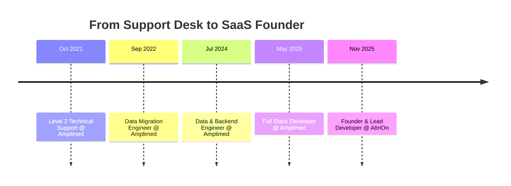

<div align="center">


<br/>

<a href="https://www.linkedin.com/in/davio-vieira"></a>
<a href="mailto:davioliveira353.do@gmail.com"></a>
<a href="https://wa.me/5518998268057"></a>

<br/>


**English** · <a href="https://github.com/oPaozinh0/.github/blob/main/profile/README.pt-BR.md">Português</a>

</div>

---

## 🧑‍💻 About Me

```php
<?php

final class Davi extends Developer
{
    public string $role       = 'Senior Full Stack Developer';
    public string $location   = 'São Paulo, Brazil 🇧🇷';
    public int    $experience = 6; // years
    public array  $stack      = ['PHP 8', 'Laravel 11', 'Vue.js 3', 'Python', 'Go', 'Docker'];
    public array  $focus      = ['Scalable Architecture', 'Performance', 'CI/CD', 'Data Engineering'];
    public array  $languages  = ['Portuguese' => 'Native', 'English' => 'Advanced'];

    public function currently(): string
    {
        return 'Building AttriOn — a SaaS for TikTok Ads automation 🚀';
    }
}
```

Full Stack Developer with **6+ years** of technical experience, a track record of **leading agile teams**
and communicating directly with stakeholders. I specialize in scalable architecture with **PHP (Laravel)**
and **Vue.js**, always aligning engineering decisions with business goals.

My background in **data quality and migration** gives me a rare bridge between Software Engineering and
Business Intelligence — I speak both *endpoint latency* and *data integrity*. Outside the IDE, I explore
digital games, which keeps a creative angle on problem-solving.

<table>
<tr>
<td width="50%" valign="top">

**⚡ Right now**

- 🔭 Building **AttriOn**, a TikTok Ads automation SaaS
- 🧪 Going deeper into **Kubernetes** and observability
- 🛠️ Shipping side tools in **TypeScript**, **Go** and **C#**

</td>
<td width="50%" valign="top">

**💬 Ask me about**

- Laravel at scale, Eloquent and query tuning
- ETL pipelines and zero-loss data migration
- Turning legacy code into a testable codebase

</td>
</tr>
</table>

---

## 📊 Impact in Numbers

<div align="center">
  
</div>

---

## 🛠️ Tech Stack

<div align="center">
  
</div>

---

## 🚀 Featured Work

<div align="center">

### 💼 AttriOn — TikTok Ads SaaS

`Founder & Lead Developer` · `Nov 2025 → Present`


</div>

- 🔌 **TikTok Business API integration** for end-to-end campaign automation
- 👥 **Multi-tenant architecture** supporting concurrent users with strict data isolation
- 🐳 **Production infrastructure** on Docker + CI/CD pipelines, holding **99.9% uptime**

<br/>

<table>
<tr>
<td width="33%" valign="top">

### 🧩 [md-this-spa](https://github.com/oPaozinh0/md-this-spa)

Chrome extension (MV3) that turns documentation pages into clean, LLM-ready Markdown — including SPAs with iframe or async-rendered content.


</td>
<td width="33%" valign="top">

### 💽 [ObsidianDisk](https://github.com/oPaozinh0/ObsidianDisk)

Modern visual disk space manager for Windows — live treemap, duplicate finder and system cleanup in a single app.


</td>
<td width="33%" valign="top">

### 🕷️ [Job-Scraper](https://github.com/oPaozinh0/Job-Scraper)

Automated job posting scraper — collects, normalizes and filters openings from multiple boards.


</td>
</tr>
</table>

---

## 💼 Career Timeline



<details>
<summary><b>📂 Click to expand the full experience breakdown</b></summary>

<br/>

### 🟣 Full Stack Developer · Amplimed *(May 2025 – Oct 2025)*
- Reduced API latency by **30%** through critical endpoint optimization
- Refactored legacy components to **Vue.js**, eliminating accumulated technical debt
- Implemented automated tests (PHPUnit) reaching **80% coverage** on new features
- Provided technical leadership in **Code Reviews**, raising the team's delivery standards

### 🔵 Data & Backend Engineer · Amplimed *(Jul 2024 – May 2025)*
- Ensured **100% integrity** on critical health data, processing millions of records with custom PHP/SQL scripts
- Automated manual ETL processes, saving ~**20 hours/month** for the operations team
- Documented data architecture and APIs, accelerating onboarding by **50%**

### 🟢 Data Migration Engineer · Amplimed *(Sep 2022 – Jul 2024)*
- Managed complex legacy database migrations with **zero data loss**
- Cut average migration time from **2 days to 10 hours** with proprietary conversion tooling

### 🟡 Level 2 Technical Support · Amplimed *(Oct 2021 – Sep 2022)*
- Resolved complex technical incidents with a **CSAT above 95%**

</details>

---

## 🎓 Education & Languages

<table>
<tr>
<td width="50%" valign="top">

**🎓 Education**

- **MBA in Data Science & Big Data Analytics**
  <br/>Faculdade Metropolitana do Estado de São Paulo · *2024*
  <br/>`Machine Learning` `Analytics for Business`

- **Technologist in Digital Game Development**
  <br/>UniSALESIANO · *2020*
  <br/>🏅 *Summa cum Laude*

</td>
<td width="50%" valign="top">

**🗣️ Languages**

- 🇧🇷 **Portuguese** — Native
- 🇺🇸 **English** — Advanced *(reading, writing and speaking)*

**🤖 AI-Accelerated Development**

- Cursor · OpenCode · Claude Code
- Prompt engineering for refactoring and testing

</td>
</tr>
</table>

---

## 🏆 Achievements

<div align="center">
  
</div>

---

## 📈 GitHub Stats

<div align="center">


<br/><br/>


<br/><br/>


<sub>📌 Numbers include private repositories — that's where most of my professional work lives.</sub>

</div>

---

## 🐍 Watch My Contributions Get Eaten

<div align="center">

<picture>
  <source media="(prefers-color-scheme: dark)" srcset="https://raw.githubusercontent.com/oPaozinh0/.github/main/profile/assets/github-snake-dark.svg" />
  <source media="(prefers-color-scheme: light)" srcset="https://raw.githubusercontent.com/oPaozinh0/.github/main/profile/assets/github-snake.svg" />
  
</picture>

</div>

---

<div align="center">

## 🤝 Let's Build Something Together

> *"Code is read far more often than it is written — optimize for the human first, the machine second."*

I'm open to conversations about **scalable backends**, **SaaS architecture** and **data engineering**.

<a href="https://www.linkedin.com/in/davio-vieira"></a>
<a href="mailto:davioliveira353.do@gmail.com"></a>
<a href="https://wa.me/5518998268057"></a>


</div>
