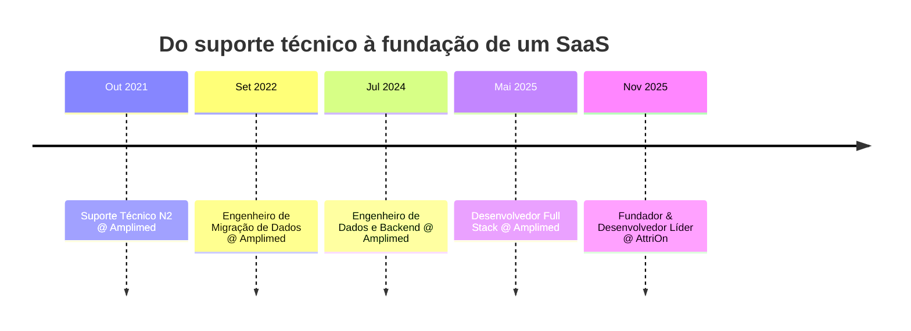

<div align="center">


<br/>

<a href="https://www.linkedin.com/in/davio-vieira"></a>
<a href="mailto:davioliveira353.do@gmail.com"></a>
<a href="https://wa.me/5518998268057"></a>

<br/>


<a href="https://github.com/oPaozinh0/.github/blob/main/profile/README.md">English</a> · **Português**

</div>

---

## 🧑‍💻 Sobre mim

```php
<?php

final class Davi extends Developer
{
    public string $cargo      = 'Desenvolvedor Full Stack Sênior';
    public string $local      = 'São Paulo, Brasil 🇧🇷';
    public int    $experiencia = 6; // anos
    public array  $stack      = ['PHP 8', 'Laravel 11', 'Vue.js 3', 'Python', 'Go', 'Docker'];
    public array  $foco       = ['Arquitetura Escalável', 'Performance', 'CI/CD', 'Engenharia de Dados'];
    public array  $idiomas    = ['Português' => 'Nativo', 'Inglês' => 'Avançado'];

    public function atualmente(): string
    {
        return 'Construindo a AttriOn — um SaaS de automação para TikTok Ads 🚀';
    }
}
```

Desenvolvedor Full Stack com **mais de 6 anos** de experiência técnica, histórico de **liderança de times ágeis**
e comunicação direta com stakeholders. Sou especializado em arquitetura escalável com **PHP (Laravel)** e
**Vue.js**, sempre alinhando decisões de engenharia aos objetivos de negócio.

Minha vivência em **qualidade e migração de dados** me dá uma ponte rara entre Engenharia de Software e
Business Intelligence — falo tanto a língua da *latência de endpoint* quanto a da *integridade de dados*.
Fora da IDE, exploro o mundo dos jogos digitais, o que mantém um ângulo criativo na resolução de problemas.

<table>
<tr>
<td width="50%" valign="top">

**⚡ No momento**

- 🔭 Construindo a **AttriOn**, um SaaS de automação para TikTok Ads
- 🧪 Me aprofundando em **Kubernetes** e observabilidade
- 🛠️ Entregando ferramentas paralelas em **TypeScript**, **Go** e **C#**

</td>
<td width="50%" valign="top">

**💬 Pode me perguntar sobre**

- Laravel em escala, Eloquent e otimização de queries
- Pipelines de ETL e migração de dados sem perdas
- Transformar código legado em base testável

</td>
</tr>
</table>

---

## 📊 Impacto em Números

<div align="center">
  
</div>

---

## 🛠️ Stack Técnica

<div align="center">
  
</div>

---

## 🚀 Trabalhos em Destaque

<div align="center">

### 💼 AttriOn — SaaS para TikTok Ads

`Fundador & Desenvolvedor Líder` · `Nov 2025 → Atual`


</div>

- 🔌 **Integração com a TikTok Business API** para automação ponta a ponta de campanhas
- 👥 **Arquitetura multi-tenant** com múltiplos usuários simultâneos e isolamento estrito de dados
- 🐳 **Infraestrutura de produção** em Docker + pipelines de CI/CD, mantendo **99,9% de uptime**

<br/>

<table>
<tr>
<td width="33%" valign="top">

### 🧩 [md-this-spa](https://github.com/oPaozinh0/md-this-spa)

Extensão Chrome (MV3) que converte páginas de documentação em Markdown limpo e otimizado para LLMs — inclusive SPAs com conteúdo em iframe ou renderizado de forma assíncrona.


</td>
<td width="33%" valign="top">

### 💽 [ObsidianDisk](https://github.com/oPaozinh0/ObsidianDisk)

Gerenciador visual de espaço em disco para Windows — treemap em tempo real, busca de duplicados e limpeza do sistema em um só app.


</td>
<td width="33%" valign="top">

### 🕷️ [Job-Scraper](https://github.com/oPaozinh0/Job-Scraper)

Scraper automatizado de vagas — coleta, normaliza e filtra oportunidades de múltiplos portais.


</td>
</tr>
</table>

---

## 💼 Linha do Tempo



<details>
<summary><b>📂 Clique para abrir o detalhamento completo da experiência</b></summary>

<br/>

### 🟣 Desenvolvedor Full Stack · Amplimed *(Mai 2025 – Out 2025)*
- Reduzi a latência da API em **30%** com otimização de endpoints críticos
- Refatorei componentes legados para **Vue.js**, eliminando dívida técnica acumulada
- Implementei testes automatizados (PHPUnit) atingindo **80% de cobertura** nas novas funcionalidades
- Atuei como liderança técnica em **Code Reviews**, elevando o padrão de entrega do time

### 🔵 Engenheiro de Dados e Backend · Amplimed *(Jul 2024 – Mai 2025)*
- Garanti **100% de integridade** em dados críticos de saúde, processando milhões de registros com scripts PHP/SQL próprios
- Automatizei processos manuais de ETL, economizando cerca de **20 horas/mês** do time de operações
- Documentei a arquitetura de dados e as APIs, acelerando o onboarding em **50%**

### 🟢 Engenheiro de Migração de Dados · Amplimed *(Set 2022 – Jul 2024)*
- Conduzi migrações complexas de bancos legados com **zero perda de dados**
- Reduzi o tempo médio de migração de **2 dias para 10 horas** com ferramentas próprias de conversão

### 🟡 Suporte Técnico N2 · Amplimed *(Out 2021 – Set 2022)*
- Resolvi incidentes técnicos complexos com **CSAT acima de 95%**

</details>

---

## 🎓 Formação & Idiomas

<table>
<tr>
<td width="50%" valign="top">

**🎓 Formação**

- **MBA em Data Science e Big Data Analytics**
  <br/>Faculdade Metropolitana do Estado de São Paulo · *2024*
  <br/>`Machine Learning` `Analytics para negócios`

- **Tecnólogo em Desenvolvimento de Jogos Digitais**
  <br/>UniSALESIANO · *2020*
  <br/>🏅 *Summa cum Laude*

</td>
<td width="50%" valign="top">

**🗣️ Idiomas**

- 🇧🇷 **Português** — Nativo
- 🇺🇸 **Inglês** — Avançado *(leitura, escrita e conversação)*

**🤖 Desenvolvimento acelerado por IA**

- Cursor · OpenCode · Claude Code
- Prompt engineering para refatoração e testes

</td>
</tr>
</table>

---

## 🏆 Conquistas

<div align="center">
  
</div>

---

## 📈 Estatísticas do GitHub

<div align="center">


<br/><br/>


<br/><br/>


<sub>📌 Os números incluem repositórios privados — é onde vive a maior parte do meu trabalho profissional.</sub>

</div>

---

## 🐍 Veja minhas contribuições sendo devoradas

<div align="center">

<picture>
  <source media="(prefers-color-scheme: dark)" srcset="https://raw.githubusercontent.com/oPaozinh0/.github/main/profile/assets/github-snake-dark.svg" />
  <source media="(prefers-color-scheme: light)" srcset="https://raw.githubusercontent.com/oPaozinh0/.github/main/profile/assets/github-snake.svg" />
  
</picture>

</div>

---

<div align="center">

## 🤝 Vamos construir algo juntos

> *"Código é lido muito mais vezes do que é escrito — otimize primeiro para o humano, depois para a máquina."*

Estou aberto a conversas sobre **backends escaláveis**, **arquitetura de SaaS** e **engenharia de dados**.

<a href="https://www.linkedin.com/in/davio-vieira"></a>
<a href="mailto:davioliveira353.do@gmail.com"></a>
<a href="https://wa.me/5518998268057"></a>


</div>
